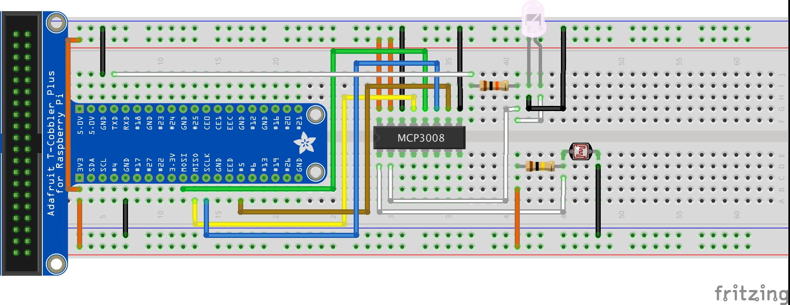
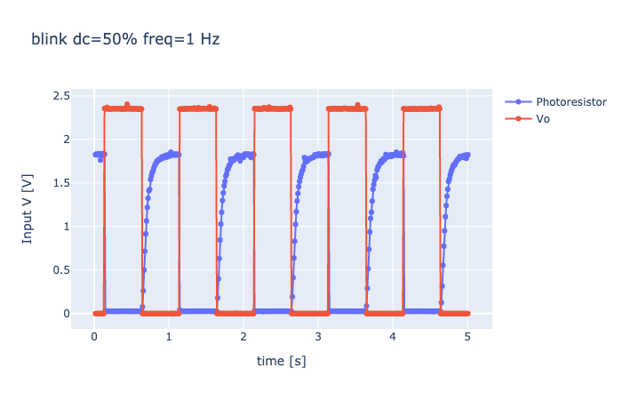
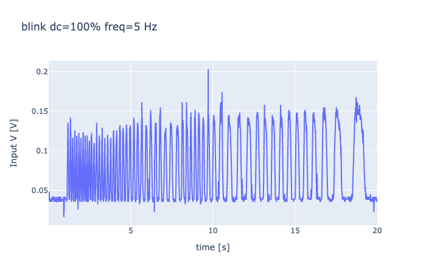

# Spirometry_via_photoresistor
A small experiment of using a Raspberry and a few components to make a sensor for spirometry.

> This is not a pi project intended for didactic purposes or similar. Just for Giuseppe's reference.

## Layout

Raspberry pi 3B with berryconda python 3.6.

* The resistor to the LED 10 k&#8486;
* The LED is 5 mm white 3.2-3.4v 20 mA
* The resistor to the ADC/photoresistor is 100 k&#8486;
* The ADC (MCP3008) is connected normally
* Photoresistor is GL5528
* GPIO 14 was controlled with software PWM for testing

## Code

_see Jupyter Notebook_

        import busio
        import digitalio
        import board
        import time
        import pandas as pd
        #import numpy as np
        import RPi.GPIO as GPIO
        from datetime import datetime, timedelta
        import plotly.graph_objects as go
        import adafruit_mcp3xxx.mcp3008 as MCP
        from adafruit_mcp3xxx.analog_in import AnalogIn
        #from scipy.signal import savgol_filter
        # file index to not over-write.
        fileindex = 0

        #MCP3008 setup
        spi = busio.SPI(clock=11, MISO=9, MOSI=10)
        cs = digitalio.DigitalInOut(board.D5)
        mcp = MCP.MCP3008(spi, cs)

        #GPIO 14 pin
        GPIO.setmode(GPIO.BCM)
        GPIO.setup(14, GPIO.OUT)
        p = GPIO.PWM(14, 1)
        p.start(100)

        # Main cell
        dc = 100
        f = 5
        title = f'blink dc={dc}% freq={f} Hz'
        tmax = 20 #sec
        fileindex += 1
        has_v_control = False
        p.ChangeDutyCycle(dc)
        p.ChangeFrequency(f)
        #title = f'blink dc={dc}% freq={f} Hz'
        test = []
        case = []
        nothing = []
        x = []
        start = datetime.now()
        while datetime.now() < start + timedelta(seconds=tmax):
            test.append(AnalogIn(mcp, MCP.P0).voltage)
            if has_v_control:
                case.append(AnalogIn(mcp, MCP.P1).voltage)
            #nothing.append(3.3 - AnalogIn(mcp, MCP.P2).voltage)
            t = datetime.now() - start
            x.append(t.seconds + t.microseconds*1e-6)
        print('Done.')
        data = [go.Scatter(x=x, y=test, name='Photoresistor', mode='lines')]
        if has_v_control:
            data.append(go.Scatter(x=x, y=case, name='Vo', mode='lines'))
        fig = go.Figure(data=data,
                    layout=dict(title=title, xaxis={'title': 'time [s]'},
                                yaxis={'title': 'Input V [V]'}))
        fig.show()
        df = pd.DataFrame(list(zip(x, test)), 
                   columns =['Time', 'Voltage'])
        filename = f'test_{dc}pc_{f}Hz_{tmax}s_{fileindex}.csv'
        df.to_csv(filename)
        print(filename)

## Pics

Control with LED blinking (red) and response (blue, 0V = bright, 2.2V = dark). No idea why its 2.2 not 3.3V. No spirometer added.

With spirometer and Giuseppe breathing into it.

